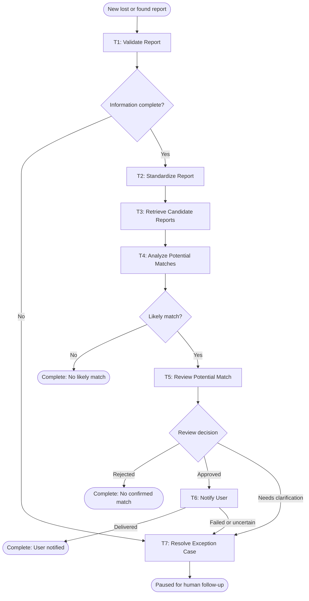

# Workflow of Tasks

## 1. Workflow Goal

This workflow supports the goal in our completed [team charter](https://github.com/bella940118-lgtm/-BUS4498_Team_Build/blob/main/README.md).

The workflow supports ItemTrace's goal of improving the success rate of returning reported lost items to their owners by analyzing lost and found reports, identifying likely matches, and notifying users of potential matches.

## 2. Workflow Trigger

The workflow begins when a new lost or found item report is submitted to ItemTrace.

## 3. Completion Condition at Runtime

One workflow run is successfully completed when the submitted report has been processed and either no likely match is identified, a human reviewer rejects the proposed match, or an approved potential-match notification is confirmed as delivered. A case awaiting exception review is paused, not successfully completed.

## 4. General Workflow

When a new lost or found item report is submitted, ItemTrace first checks the report for the information needed to evaluate potential matches. The system then standardizes the report details so that descriptions can be compared consistently. It retrieves relevant reports from the opposite report type and analyzes characteristics such as item type, description, location, and date to identify potential matches.

If required information is missing, the report is sent for human review rather than continuing with incomplete information. If the system identifies a likely match, a human reviewer verifies the potential match before any notification is sent. If the reviewer approves the match, ItemTrace notifies the appropriate user of the potential match. If the reviewer rejects the match, the report is recorded as having no confirmed match and the workflow ends. If the reviewer needs clarification, the case is sent to T7 and paused. If a required automated tool fails after its allowed retries, the case is sent to T7 for human review and the workflow is paused for follow-up.

## 5. Workflow Diagram

If T1, T2, T3, or T4 fails after its allowed retries, the case is also routed to T7 and paused for human resolution.
